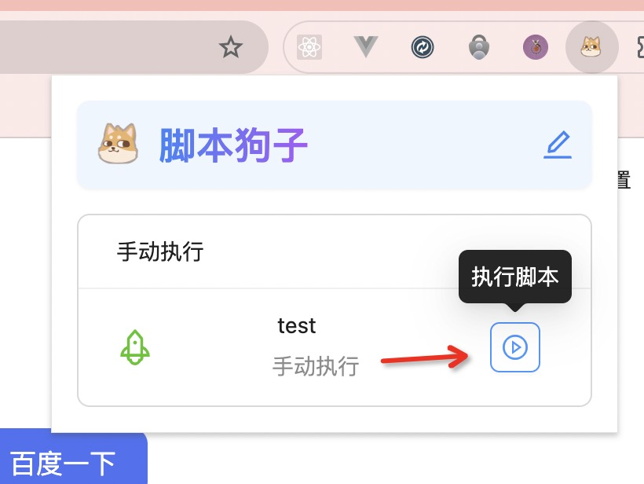

# 脚本狗子 - Chrome 自定义脚本管理器

脚本狗子是一个强大的 Chrome 浏览器插件，专为管理和执行自定义 JavaScript 脚本而设计。无论您是开发人员、网页自动化爱好者，还是只是想增强浏览体验的普通用户，脚本狗子都能满足您的需求。

## 主要特性

- **脚本存储**：安全地保存您的自定义 JavaScript 脚本。
- **灵活执行**：支持自动执行和手动触发两种模式。
- **用户友好界面**：直观的操作界面，轻松管理您的脚本。
- **高度可定制**：为不同网站设置不同的脚本执行规则。

## 如何使用

1. 从 Chrome 网上应用店安装脚本狗子插件。
2. 点击浏览器工具栏中的脚本狗子图标，打开插件界面。
3. 在选项页面中添加、编辑或删除您的脚本。

4. 为每个脚本设置执行模式（自动或手动）和匹配规则。
5. 浏览网页时，脚本将根据您的设置自动执行或等待手动触发。
6. 在浏览器工具栏中点击插件图标，可以快速执行已配置的脚本。

## 注意事项

- 请谨慎使用自动执行模式，确保脚本不会对您访问的网站造成意外影响。
- 定期检查和更新您的脚本，以确保它们与目标网站的变化保持兼容。
- 尊重网站的使用条款和隐私政策。

## 贡献

欢迎为脚本狗子项目做出贡献！如果您有任何改进建议或发现了 bug，请在我们的 GitHub 仓库中提出 issue 或提交 pull request。

## 许可证

本项目采用 MIT 许可证。详情请参阅 LICENSE 文件。

---

享受使用脚本狗子带来的便利吧！如有任何问题或反馈，欢迎联系我们。